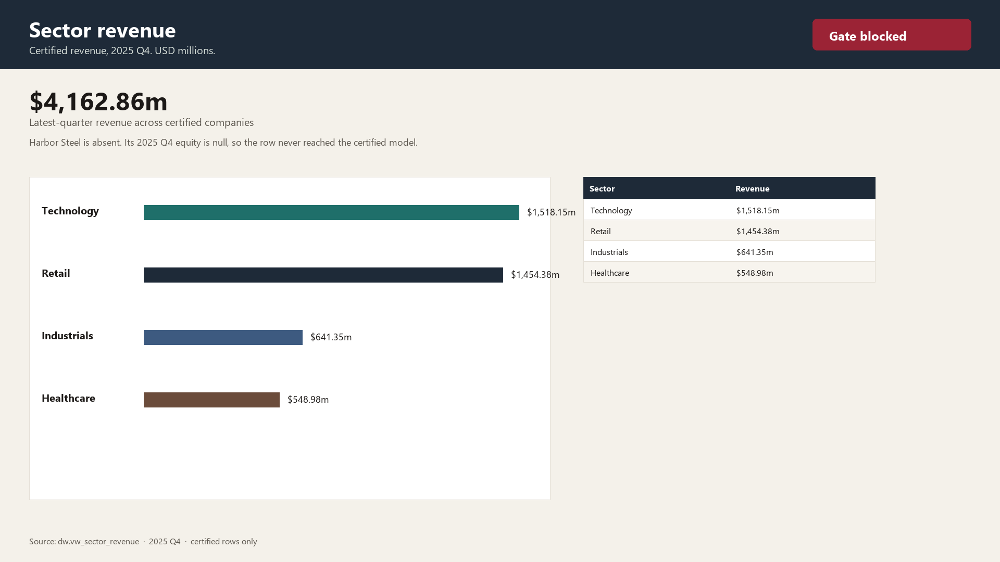
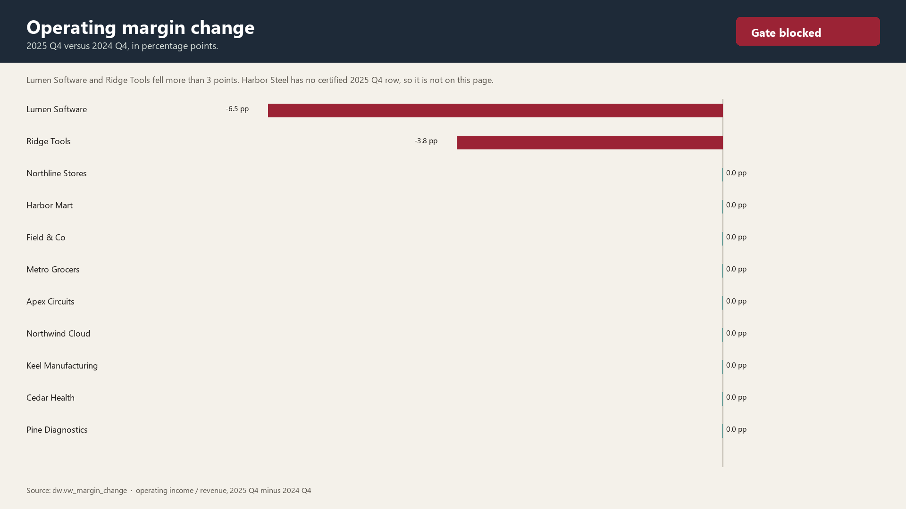
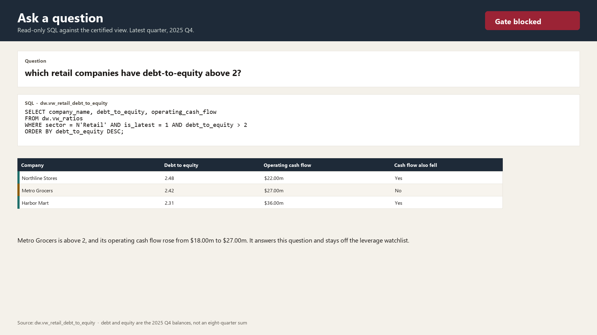
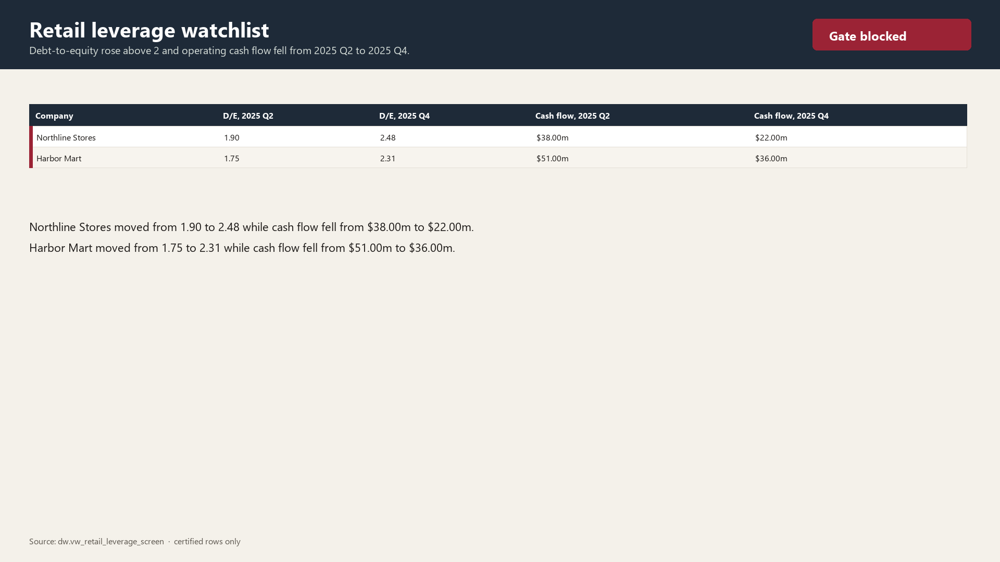
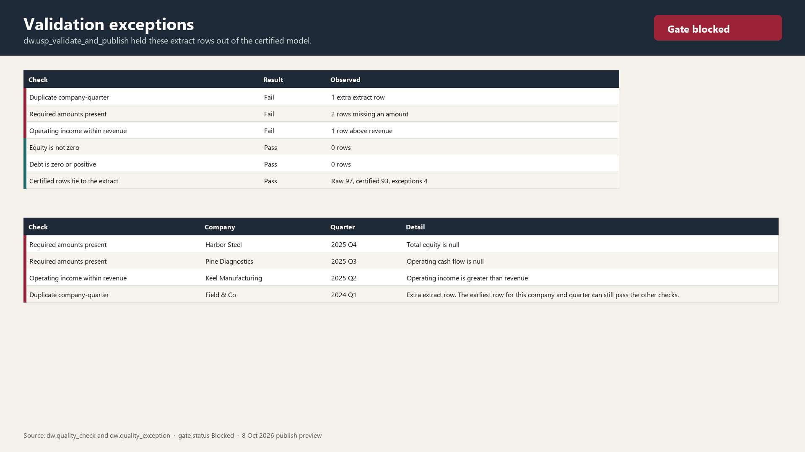
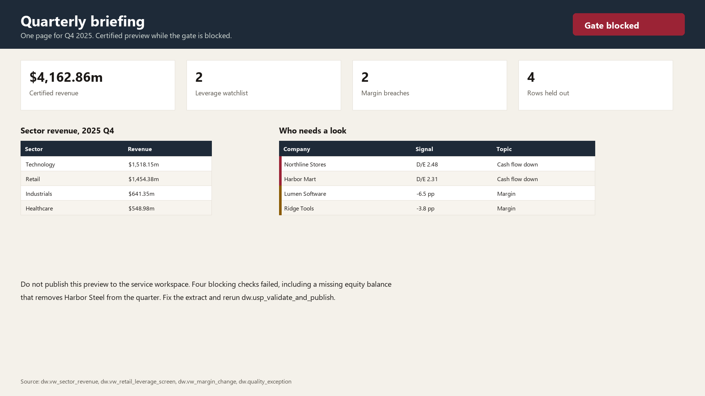

# Financial BI Cockpit

A SQL Server validation gate and a Power BI report for a fictional 12-company panel, covering 2024 Q1 through 2025 Q4. Amounts are USD millions.

The extract is supposed to fail the gate. Certified charts still build from the rows that pass. Power BI should not refresh a published report until `dw.usp_validate_and_publish` returns **Passed**.

## What the gate found

| | |
|---|---|
| Raw extract rows | 97 |
| Certified rows | 93 |
| Exceptions | 4 |
| Gate | Blocked |

Held out of the model:

- Harbor Steel, 2025 Q4 — total equity is null
- Pine Diagnostics, 2025 Q3 — operating cash flow is null
- Keel Manufacturing, 2025 Q2 — operating income is greater than revenue
- Field & Co, 2024 Q1 — extra extract row

Harbor Steel is missing from 2025 Q4 revenue because that row never became certified.

## Report pages

Certified revenue for 2025 Q4 is **$4,162.86m**. Technology is the largest sector. Industrials exclude Harbor Steel.

Operating margin versus 2024 Q4. Lumen Software is down **6.5** points. Ridge Tools is down **3.8** points.

### Question

`which retail companies have debt-to-equity above 2?`

The view `dw.vw_retail_debt_to_equity` answers it from the latest quarter only. Debt and equity are balances, so they are not summed across the eight quarters.

| Company | Debt to equity | Operating cash flow | Cash flow also fell |
|---|---:|---:|---|
| Northline Stores | 2.48 | $22.00m | Yes |
| Metro Grocers | 2.42 | $27.00m | No |
| Harbor Mart | 2.31 | $36.00m | Yes |

Metro Grocers is above 2, and its cash flow rose, so it stays off the watchlist. The watchlist is the stricter screen: debt-to-equity rose above 2 **and** operating cash flow fell from 2025 Q2 to 2025 Q4.

## One-page briefing

`docs/quarterly-briefing-2025-q4.pdf` is the quarterly pack: certified revenue, the two leverage names, the two margin breaches, and the four held rows.

## Demo

[docs/demo.mp4](docs/demo.mp4) is a 30-second recording of this file open in Power BI Desktop. It starts on sector revenue, moves to the retail debt-to-equity page, then opens the validation exceptions. A shorter loop is in [docs/demo.gif](docs/demo.gif).

The retail page is the answer to “which retail companies have debt-to-equity above 2?”: Harbor Mart 2.31, Metro Grocers 2.42, and Northline Stores 2.48.

Open `FinancialCockpit.pbix` in Power BI Desktop for the same five pages:

1. Sector revenue
2. Margin change
3. Retail debt to equity
4. Leverage watchlist
5. Validation exceptions

The **Debt to Equity** measure reads 2025 Q4 only. On the modeling view, ask the same retail question in the Q&A box. The committed answer is the table on page 3, which matches `dw.vw_retail_debt_to_equity`.

## Run the SQL

In SSMS or Azure Data Studio, against SQL Server 2016 or newer:

1. Run `sql/00_create_database.sql` from `master`.
2. Run `sql/01_schema.sql` through `sql/05_run_and_review.sql` in order.

`sql/05_run_and_review.sql` executes `dw.usp_validate_and_publish` and returns the gate, the exceptions, the retail answer, the watchlist, the margin breaches, and sector revenue.

Ratio definitions live in `sql/03_views.sql`:

- `dw.vw_ratios` — operating margin and debt-to-equity
- `dw.vw_retail_debt_to_equity` — retail companies above 2 in the latest quarter
- `dw.vw_retail_leverage_screen` — above 2, and cash flow down over the last three quarters
- `dw.vw_margin_change` — 2025 Q4 margin versus 2024 Q4
- `dw.vw_sector_revenue` — latest-quarter revenue by sector

`data/` holds the same certified results as CSV, so the numbers in the report can be checked without SQL Server. `tools/build_project.py` rebuilds the seed, the CSVs, the images, the PDF, the demo, and the `.pbix` from those rules.
